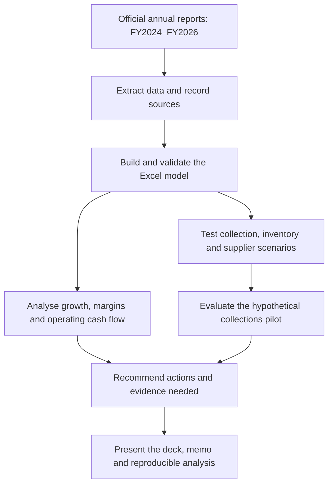
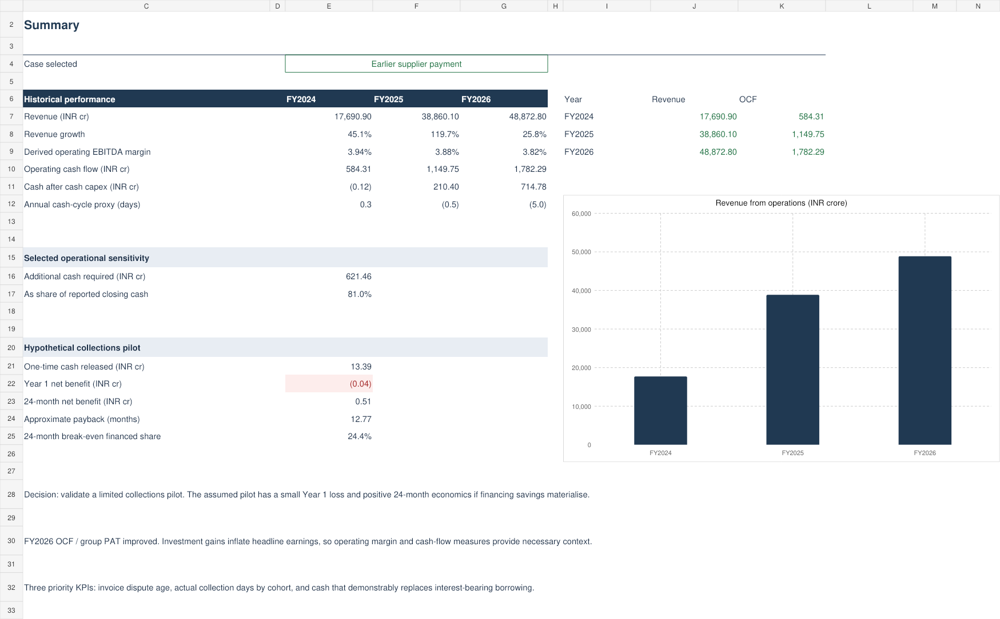
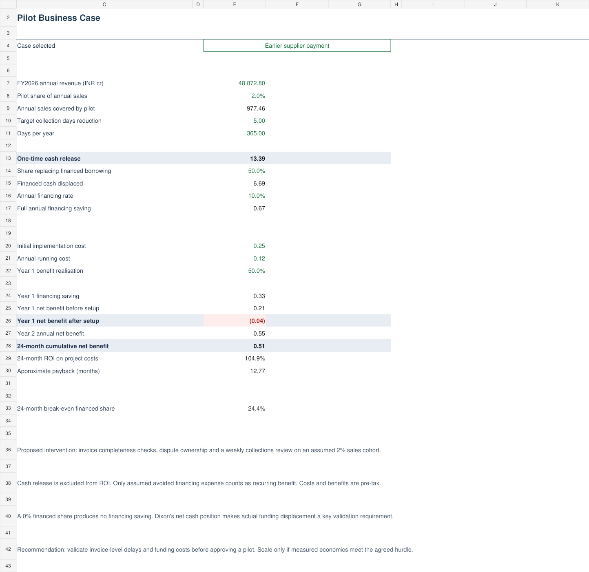

# Dixon Technologies: Cash Conversion & Operations Improvement

An independent public-data case study by Hisham Siddiqui. This project studies how an electronics manufacturing business earns operating profit, funds growth and manages cash tied up in operations.

## Project flow



## Open the deliverables

- [Excel model](model/Dixon_Cash_Conversion_Model.xlsx)
- [Recommendation deck PDF](reports/Dixon_Recommendation_Deck.pdf)
- [Editable PowerPoint](reports/Dixon_Recommendation_Deck.pptx)
- [Executive memo](reports/Dixon_Executive_Memo.pdf)
- [Learning guide](docs/LEARNING_GUIDE.md)
- [Source register](docs/SOURCE_REGISTER.md)
- [Cash-flow screen reconciliation](docs/CASH_FLOW_RECONCILIATION.md)

The PDF files and documentation can be viewed on GitHub. Download the workbook to change Excel assumptions. The screenshots below are viewing previews.

## Build log

### Step 1 - Official sources verified

Retrieved Dixon's FY2024, FY2025 and FY2026 integrated annual reports from links on its official website. We use consolidated statements, meaning the parent company and its subsidiaries together. Figures are in INR lakhs in the reports. The model displays INR crore, so every reported amount is divided by 100.

The three analysis years are years ended 31 March 2024, 2025 and 2026. FY2023 is only an opening-balance reference for average balances and FY2024 growth. FY2025 values from FY2026's comparative columns agree with the key figures in the FY2025 report. FY2024 values use FY2025 comparatives, checked against the FY2024 report.

Important source findings: profit includes investment-related gains, the cash-flow statement contains acquisition/disposal adjustments, and management's working-capital days use a quarterly basis. Our annual-average proxies are defined separately, so they are not expected to match management's days exactly.

We also reconciled the rounded [Screener consolidated cash-flow table](https://www.screener.in/company/540699/consolidated/) to the official report. Its FY2026 INR537 crore net cash movement includes INR112.98 crore from changes in the consolidated group, in addition to INR423.60 crore from operating, investing and financing flows. The [short reconciliation](docs/CASH_FLOW_RECONCILIATION.md) explains the presentation difference and why free-cash-flow and cash-conversion labels require definitions.

This is an independent student analysis. It reports a proposed intervention rather than measured implementation results. Scenarios and pilot economics are assumptions rather than achieved company results.

### Step 2 - Historical diagnostic and Excel model completed

Built a formula-driven workbook with seven sheets: Start Here, Summary, Assumptions, Performance, Cash Scenarios, Pilot Business Case, and Sources & Data. Source amounts stay in lakh and formula links convert them to crore. Yellow cells contain editable assumptions. The case selector uses CHOOSE to feed one calculation model.

### Step 3 - Cash scenarios and pilot economics checked

Tested no change and three isolated five-day changes. Independently recalculated the financial outputs using standard-library Python. Reconciled assets with equity and liabilities, profit with its components, operating cash flow with cash generated less tax, and closing cash with opening cash plus cash-flow activities and group-structure changes. Tested zero financing savings and zero collection improvement. Workbook checks also tested a missing selected assumption and a missing unselected assumption.

### Step 4 - Recommendations and presentation completed

Prepared a six-slide recommendation deck, a one-page executive memo and a learning guide. The recommendation is conditional: obtain invoice-level and funding evidence before approving a pilot, then scale only if measured economics support it. The deck and memo show a snapshot of the default assumptions. They do not automatically update when the workbook changes.

The final deck also states the second proposed action: review collection, inventory and supplier metrics weekly. The cash-flow slide includes the FY2026 group-cash bridge. The memo remains a concise pilot business case; the reconciliation note explains the external stock-screen comparison in full.

## Main findings

| Consolidated metric | FY2024 | FY2025 | FY2026 |
|---|---:|---:|---:|
| Revenue from operations, INR crore | 17,690.90 | 38,860.10 | 48,872.80 |
| Revenue growth | 45.1% | 119.7% | 25.8% |
| Derived operating EBITDA margin | 3.94% | 3.88% | 3.82% |
| Net operating cash flow, INR crore | 584.31 | 1,149.75 | 1,782.29 |
| OCF / group reported PAT | 1.56x | 0.93x | 1.08x |
| Cash after cash capex, INR crore | (0.12) | 210.40 | 714.78 |
| Annual-average cash-cycle proxy, days | 0.3 | (0.5) | (5.0) |

Revenue increased substantially, while the derived operating margin narrowed modestly. FY2025 PAT includes an exceptional gain of INR459.98 crore. FY2026 other income includes an equity investment disposal/fair-value gain of INR670.75 crore and a business-sale gain of INR21.88 crore. These are pre-tax gains, not amounts that can be deducted directly from after-tax profit without tax adjustments.

FY2026 OCF rose by 55.0% from FY2025. The total working-capital cash-flow effect improved from an INR181.62 crore outflow to an INR223.33 crore inflow. Trade inventory/receivables/payables contributed INR54.54 crore of the FY2026 inflow, with other operating balances contributing the rest. Cash-flow adjustments are more reliable for this bridge than simply subtracting closing balance sheets, because acquisitions and disposals alter the consolidation perimeter.

Supplier days increased more than collection and inventory days in our annual-average proxies. This supports an interpretation of supplier funding contributing to a shorter cash cycle. It does not establish that Dixon delayed invoices beyond their contractual due dates. Management reports FY2026 working-capital days of negative 8 on a quarterly basis. Our annual-average proxy is negative 4.96 and uses different denominators and coverage.

## Operational cash scenarios

Each default change affects the whole consolidated business at FY2026 volumes. These are isolated sensitivities, not forecasts or probabilities.

| Scenario | Assumed change | Additional cash required, INR crore |
|---|---|---:|
| Collections delay | Customers pay 5 days later | 669.49 |
| Inventory buffer | Hold 5 more materials-based inventory days | 620.24 |
| Earlier supplier payment | Supplier payment days fall by 5 | 621.46 |

These amounts are roughly 81-87% of reported closing cash of INR767.43 crore. This is a scale comparison, not a forecast of insolvency or proof of a funding shortfall. Credit facilities, seasonal receipts, cash restrictions and other funding sources are outside this model.

## Proposed collections pilot

The intervention would check invoice completeness before submission, assign an owner to disputes, and review overdue invoices weekly for a defined sales cohort. Possible causes such as documentation errors or disputes remain hypotheses until ledger data confirms them.

| Analyst assumption | Default |
|---|---:|
| Sales in pilot | 2% of FY2026 revenue |
| Collection improvement | 5 days |
| Released cash replacing financed borrowing | 50% |
| Avoidable financing rate | 10% a year |
| Initial implementation cost | INR0.25 crore (INR25 lakh) |
| Annual running cost | INR0.12 crore (INR12 lakh) |
| Year 1 benefit realisation | 50% of full annual saving |

These are deliberately labelled assumptions. They are not actual vendor quotations, management targets or Dixon's borrowing rate.

The defaults imply INR13.39 crore of one-time cash release, INR0.67 crore of full annual financing savings, an approximately INR3.53 lakh Year 1 loss after setup, INR51.42 lakh cumulative net benefit over 24 months, and approximate payback of 12.77 months. The pre-tax 24-month ROI on project costs is 104.9%. Cash release itself is excluded from ROI and payback benefits.

The model requires at least 24.4% of the released cash to replace borrowing at the assumed 10% rate to break even over 24 months. At a 0% funded share, financing savings are zero and the project does not pay back through this benefit channel. Dixon has INR299.93 crore of cash less borrowings at FY2026 year-end, excluding leases. We therefore cannot assume that all released cash avoids interest.

## Recommendation and implementation

1. **Validate the cash exposure.** Treasury and accounts receivable teams would identify the actual funding source, avoidable interest rate and a matched invoice cohort. Procurement would review supplier terms and cash timing. These are proposed responsibilities, not interviews conducted for this project.
2. **Run a limited pilot only after validation.** Compare the treated invoice cohort with a comparable untreated cohort. Track invoice acceptance, dispute age, collection days, bad debts and financing balances. Maintain customer service and supplier payment compliance.
3. **Scale only on measured economics.** Verify that cash collections accelerated without discounts or adverse customer behaviour that erase the benefit. Approve further investment only if the financing savings and costs support an agreed return hurdle.
4. **Review working capital weekly.** Monitor collection and inventory days, supplier terms, invoice disputes and borrowing balances together. Investigate changes and protect agreed supplier-payment terms; the public annual figures alone cannot identify individual payment causes.

Suggested sequence: weeks 1-2 establish invoice and funding baselines, weeks 3-6 test the process, weeks 7-8 compare cohorts, then decide whether to extend observation or scale. These are proposed timings. A short pilot will not prove a full year's savings.

## Open and use the project

1. Download the project ZIP and extract it.
2. Open `model/Dixon_Cash_Conversion_Model.xlsx` in Excel.
3. Read `Start Here`, then `Summary`.
4. Change `Assumptions!E5` to 1, 2, 3 or 4. The selected case feeds the same model.
5. Inspect `Cash Scenarios!E21` for the total cash effect.
6. Edit pilot inputs in `Assumptions!E33:E39` and inspect `Pilot Business Case`.
7. Try setting `Assumptions!E35` to 0%. The financing saving should become zero and payback should show `n.a.`.

Use percentages between 0% and 100% for sales scope, financed share and benefit realisation. Use non-negative costs, rates and improvement targets. Restore defaults after experimentation if you want the workbook to match the presentation. If Excel does not recalculate, choose Formulas > Calculation Options > Automatic, then press Ctrl+Alt+F9.

The Python calculation path is optional. With Python installed, open Command Prompt in the extracted project folder and run:

```cmd
python scripts\analyse.py --check
```

If your Windows installation uses the Python launcher:

```cmd
py scripts\analyse.py --check
```

This checks and regenerates `data/calculated_results.json` and `data/reported_financials.csv` from the JSON inputs. It does not change the Excel workbook or slides. No pip packages, API keys, server or internet connection are required for this calculation script.

## Files and tools

| File | Purpose |
|---|---|
| `model/Dixon_Cash_Conversion_Model.xlsx` | Editable model, historical analysis and pilot business case |
| `reports/Dixon_Recommendation_Deck.pptx` | Six editable slides with native charts and tables |
| `reports/Dixon_Recommendation_Deck.pdf` | Viewing copy of the deck |
| `reports/Dixon_Executive_Memo.pdf` | One-page recommendation |
| `docs/LEARNING_GUIDE.md` | Simple explanations, formula locations and interview preparation |
| `docs/SOURCE_REGISTER.md` | Official URLs, source pages and definition choices |
| `docs/CASH_FLOW_RECONCILIATION.md` | Screener-to-annual-report cash bridge and metric caveats |
| `docs/GITHUB_SETUP.md` | Instructions to publish the extracted files on GitHub |
| `data/financials.json` | Report values in lakh and per-metric source locations |
| `data/assumptions.json` | Explicit default scenario and pilot assumptions |
| `scripts/analyse.py` | Independent calculations using Python's standard library |

Excel formulas perform the interactive calculations. The workbook and PowerPoint files were authored with JavaScript and an Office artifact library. Python's built-in JSON, CSV, pathlib and argparse modules provide the reproducible analysis. ReportLab creates the memo and deck viewing copy. No company accounts, private operational data or paid services were used.

## Method and limitations

Inventory days use average total inventory divided by materials consumed plus inventory-change expense. This is a materials-based cost proxy, not a disclosed full COGS figure. Supplier days use average total trade payables divided by reported raw material/component purchases. Collection days use net trade receivables divided by revenue because credit-only sales are not separately available in the extracted statements. GST, exports, seasonality, other procurement categories, acquisition timing and changes in business mix may affect comparability.

Cash after capex is OCF minus cash capex. It excludes separate interest/lease payments, acquisitions and other investing flows, so it is not a comprehensive free-cash-flow definition. Annual-average days are descriptive proxies rather than invoice-level delay measures.

The financial model and boundary cases were tested in the authoring calculation engine and checked independently with Python. The files were rendered and visually reviewed. Excel desktop and PowerPoint desktop were not available for native application testing. The deck's native charts are editable snapshots, not live links to the main workbook.

## Resume wording after reviewing the project

- Analysed three years of Dixon's consolidated financial statements and built an Excel model linking profitability, operating cash flow and working-capital proxies, with source references and financial reconciliations.
- Modelled collection, inventory and supplier-payment sensitivities and evaluated a hypothetical collections pilot through financing savings, payback and 24-month ROI, separating cash release from profit impact.

## Preview




